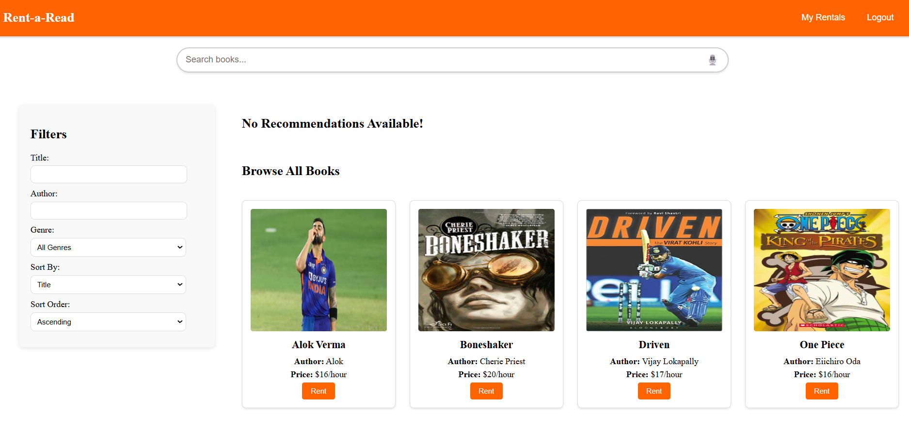
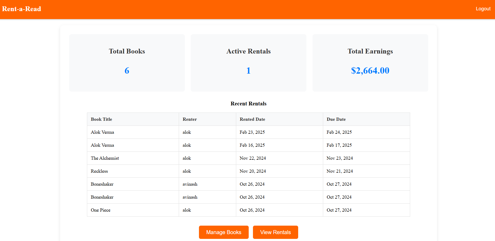

# Rent-a-Read 📚

## Description 📝

Rent-a-Read is a secure, cloud-powered eBook rental system designed to make reading accessible and affordable for everyone. Built with Angular for a dynamic frontend, Flask for the backend, and MongoDB for robust data storage, the project enables users to rent eBooks with secure access via AWS S3. This project supports role-based functionalities for Readers and Book Owners, allowing seamless book rental and management.

## Tech Stack ⚙️

- **Frontend:**
  - Angular

- **Backend:**
  - Flask (Python)
  - MongoDB
  - AWS S3 (for content storage and streaming)

- **Deployment:**
  - Vercel (Frontend)
  - Render (Backend)

## Features ✨

### Reader Features:
- **Browse and Search Books:**
- **Rent eBooks:**
- **View and Access Rentals:**

### Owner Features:
- **Dashboard:**
- **Book Management:**
- **Rental Management:**

### Authentication:
- Role-based authentication for Readers and Book Owners using JWT tokens.

### Secure Access:
- Signed URLs for secure and time-bound eBook access.

## Snapshots 🖼️

### Login

### Reader Home

### Owner Home

## Contributions 🤝

All contributions are welcome! If you spot any issues, have suggestions, or want to add features, feel free to create a PR. Thanks for contributing to this project! 🚀

## Future Enhancements 🚀
- **Profile Management**
- **ProperRevenue Model**
- **Mobile App**
- **Personalised Recommendations**

## Connect 

### Leave a 🌟 if you like it!
### Happy Reading! 📖
